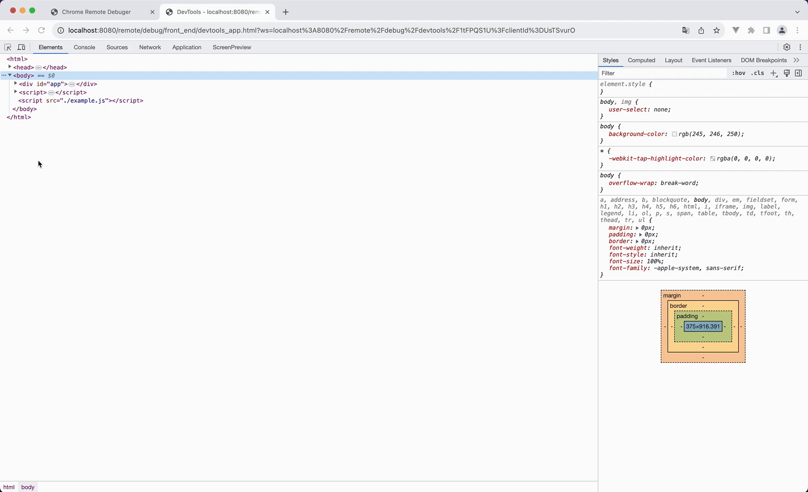

# Devtools Remote Debugger

[中文文档](./README_CN.md)

Based on Google's open-source [devtools-frontend](https://github.com/ChromeDevTools/devtools-frontend), you can use JavaScript to implement the [Chrome DevTools Protocol](https://chromedevtools.github.io/devtools-protocol/) . By simply loading a piece of JavaScript code on a web page, you can use the familiar Chrome DevTools to remotely debug the page.

The web page being debugged connects to an intermediate Node layer via WebSocket, and DevTools also connects to the Node layer via WebSocket. The primary role of the Node intermediate layer is to forward socket protocols between the web page and DevTools, enabling full-duplex communication between them.

Additionally, this project has been included in the [awesome-chrome-devtools](https://github.com/ChromeDevTools/awesome-chrome-devtools#browser-adapters) collection.


## 🎬 Debug DEMO

https://github.com/Nice-PLQ/devtools-remote-debugger/assets/10710341/93c5cbb4-c13d-4f93-866c-9b97ffc327e9

## 🎉 Features:

### Elements

- Display Html Tags
- Edit Html Attributes
- Display Style Rules
- Highlight Node

<details>
  <summary>
    Preivew
  </summary>




</details>

### Console

- Execute JavaScript Code
- Show Error Stack

<details>
  <summary>
    Preivew
  </summary>


</details>

### Sources

- Show Source Code

<details>
  <summary>
    Preivew
  </summary>


</details>

### Network

- Show XHR/Fetch Request
- Show JavaScript/CSS/HTML Request
- Show Image Request

<details>
  <summary>
    Preivew
  </summary>


</details>

### Application

- Local Storage
- Session Storage
- Cookies

<details>
  <summary>
    Preivew
  </summary>


</details>

### ScreenPreview

- Live Preview

<details>
  <summary>
    Preivew
  </summary>


</details>

## How to start?

Open the command terminal and start the following two commands

### 1. Start Serve

```sh
#1. Start the node service
npm run serve

# 2. Start a new terminal
npm run client
```

### 2. Open the debug page

Open two pages in the browser

- Debug DEMO page: [http://localhost:8080/remote/debug/example/index.html](http://localhost:8080/remote/debug/example/index.html)
- debug background: [http://localhost:8899/page/index.html](http://localhost:8899/page/index.html)


## How to use?

1、Modify the variables of the `.env` file

```sh
# The port number to start the Node, such as: port 80
DEBUG_PORT=8080
# Debug the domain name after the deployment of the backend, such as: https://www.remote-debug.com/
DEBUG_HOST='http://localhost:8080'
```

2. Execute `npm run build` to build the project code, and the `dist` directory will be packaged. The structure is as follows:

```
├── page    # Debug backend
│   ├── index.css
│   ├── index.html
│   ├── index.js
├── cdp.js  # The CDP code for debugging needs to be loaded on the page being debugged. You can deploy it to a CDN.
```

3. Start the backend

```sh
npm run start
```

4. The browser opens the debugging backend [http://www.debug.com/remote/debug/index.html](http://www.debug.com/remote/debug/index.html), if the debugging target page loads the `cdp.js` code, then the debugging backend will see the connection record

> 💡Please note that www.debug.com is just an example, please replace it with your own specific domain.

## Additional Information

Due to the restrictions of the same-origin policy, you may need to make the following changes:

- By default, the browser does not allow JavaScript to read CSSRules from different domains. Therefore, when including external styles via a link, you need to add the attribute `crossorigin="anonymous"`. This issue does not apply to styles within style tags.
- To capture detailed JavaScript error information, you also need to add `crossorigin="anonymous"` to the script tags.

## Star History

[](https://star-history.com/#Nice-PLQ/devtools-remote-debugger&Date)

## License

[MIT](./LICENSE)

Copyright (c) Nice-PLQ
