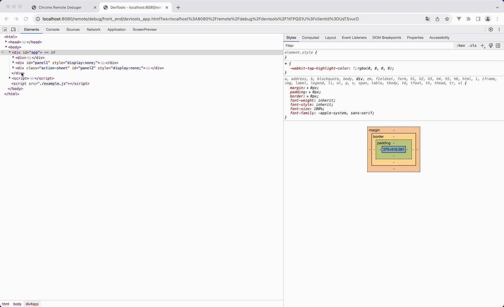
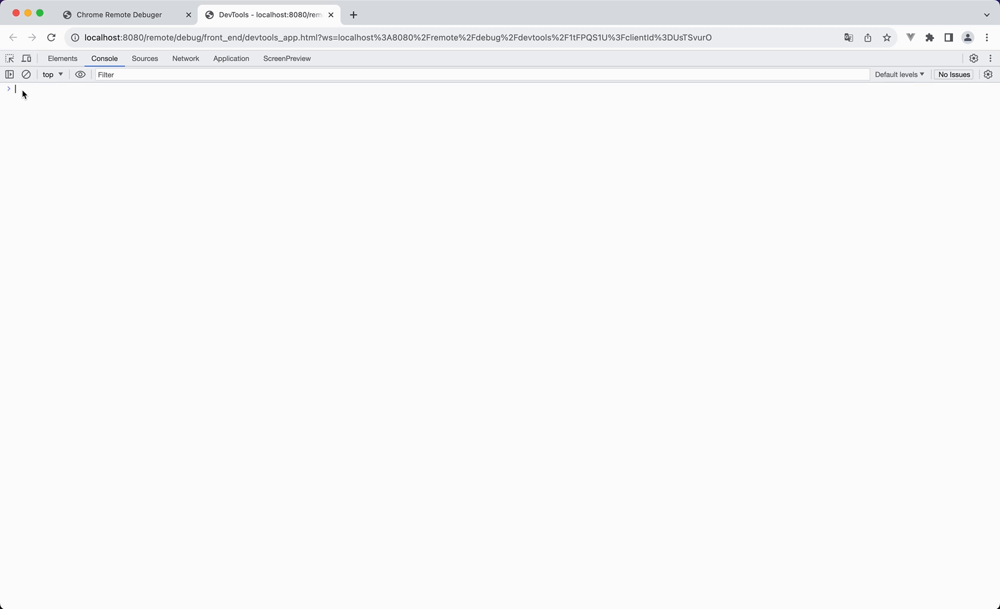
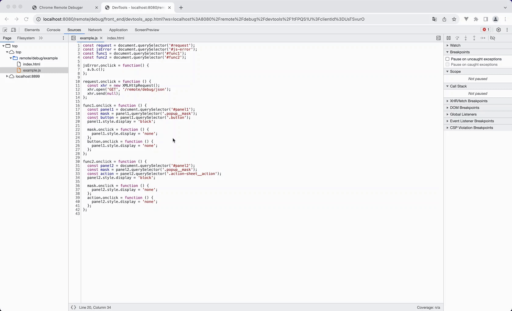
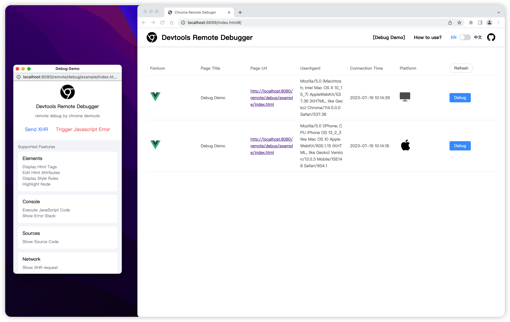

# Chrome devtool 的远程调试

基于谷歌开源的[devtools-frontend](https://github.com/ChromeDevTools/devtools-frontend)开发者工具，并用 JavaScript 实现[Chrome DevTools Protocol](https://chromedevtools.github.io/devtools-protocol/)协议。只需要在 web 页面中加载一段 js 脚本即可用最熟悉的 chrome devtools 来远程调试页面。

被调试的 web 页面通过 websocket 连接到中间的 node 层，devtools 同样也通过 websocket 连接到 node。node 中间层的作用主要进行 socket 协议的相互转发，以此让 web 页面和 devtools 实现全双工的通信。


## 🎬 调试 DEMO

https://github.com/Nice-PLQ/devtools-remote-debugger/assets/10710341/93c5cbb4-c13d-4f93-866c-9b97ffc327e9

## 🎉 支持的特性：

### Elements

- html 的实时查看，属性编辑、Styles、Computed 样式查看、hover 元素高亮、元素审查

<details>
  <summary>
    Preivew
  </summary>




</details>

### Console

- js 运行时的错误堆栈查看、 js 代码执行、查看 console.error/warn 调用堆栈。

<details>
  <summary>
    Preivew
  </summary>



</details>

### Sources

- js 运行时的错误代码文件定位索引、查看 html、js、css 源文件内容、代码格式化。

<details>
  <summary>
    Preivew
  </summary>



</details>
  
### Network
  - 异步请求抓包、html、js、css、image 静态资源请求抓包。

<details>
  <summary>
    Preivew
  </summary>


</details>

### Application

- Local Storage、Session Storage、Cookies。

<details>
  <summary>
    Preivew
  </summary>


</details>

### ScreenPreview（自定义）

- 页面实时预览。

<details>
  <summary>
    Preivew
  </summary>


</details>

## 本地开发

打开命令终端，启动以下两个命令

### 1、启动服务

```sh
# 1、启动node服务
npm run serve

# 2、新开终端启动
npm run client
```

### 2、打开调试页面

在浏览器分别打开两个页面

- 调试 DEMO 页面：[http://localhost:8080/remote/debug/example/index.html](http://localhost:8080/remote/debug/example/index.html)
- 调试后台：[http://localhost:8899/page/index.html](http://localhost:8899/page/index.html)



## 如何使用？

1、修改`.env`文件的变量

```sh
# 启动node服务的端口号，如：80端口
DEBUG_PORT=80
# 调试管理端部署之后的域名，如：http://www.debug.com/
DEBUG_HOST='http://www.debug.com/'
```

2、执行`npm run build`构建项目代码，会打包出`dist`目录，结构如下：

```
├── page    # 调试管理端
│   ├── index.css
│   ├── index.html
│   ├── index.js
├── sdk.js  # 调试用的sdk代码，需要在被调试页面中加载该脚本，可以将其部署到cdn
```

3、启动 Node 服务

```sh
npm run start
```

4、浏览器打开调试管理端[http://www.debug.com/remote/debug/index.html](http://www.debug.com/remote/debug/index.html)，如果调试目标页面加载了`sdk.js`代码，那么此时调试管理端会看到连接记录。

> 💡 请注意，www.debug.com只是作为示例，具体的域名请换成自己的

## 其他说明

由于同源策略的限制，你可能需要进行以下的变更：

- 浏览器默认不允许 JavaScript 读取不同域的 CSSRule，所以你需要在 link 引入外部样式的时候加上`crossorigin="anonymous"`属性，style 标签的样式没有此问题。
- 捕获 Javascript 的具体错误信息，同样需要在 script 标签添加`crossorigin="anonymous"`。

## License

[MIT](./LICENSE)

Copyright (c) Nice-PLQ
